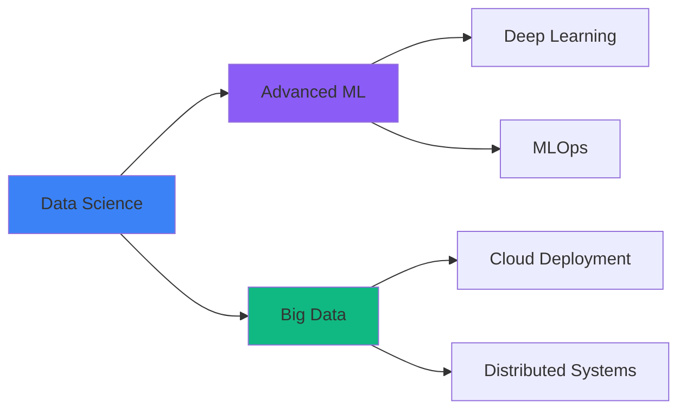

<div align="center">

# 👋 Hi, I'm Avisha Dilshan

### Data Scientist | ML Engineer | Cloud & Big Data Specialist


[](https://www.linkedin.com/in/avisha-dilshan/)
[](https://github.com/avisha2003)
[](mailto:avishadilshan01@gmail.com)

</div>

---

## 🚀 About Me

```python
class DataScientist:
    def __init__(self):
        self.name = "Avisha Dilshan"
        self.role = "Data Scientist & ML Engineer"
        self.education = "BSc (Hons) IT - Data Science @ SLIIT"
        self.location = "Sri Lanka 🇱🇰"
        self.gpa = 3.36
        
    def expertise(self):
        return {
            "data_science": ["Statistical Analysis", "Feature Engineering", 
                           "Data Preprocessing", "Exploratory Data Analysis"],
            "machine_learning": ["Supervised Learning", "Time Series Forecasting",
                               "Deep Learning", "Model Optimization"],
            "big_data": ["Hadoop", "MapReduce", "Distributed Computing"],
            "cloud": ["AWS", "Azure", "Scalable Architecture"],
            "ai_tools": ["TensorFlow", "Prophet", "OpenAI", "Gemini AI"]
        }
    
    def currently_mastering(self):
        return ["Advanced ML Algorithms", "Cloud ML Deployment", 
                "Big Data Analytics", "MLOps"]
```

🎯 **Mission:** Leveraging data science and machine learning to solve complex real-world problems  
📊 **Focus Areas:** Predictive Analytics | Time Series Forecasting | NLP | Computer Vision  
☁️ **Cloud Experience:** AWS & Azure for scalable ML solutions  
🔬 **Research Interests:** Deep Learning, Big Data Processing, AI-driven Automation  

---

## 🧠 Core Competencies

### Data Science & Analytics


**Skills:** Statistical Analysis • Data Preprocessing • Feature Engineering • EDA • Data Visualization

---

### Machine Learning & AI


**Expertise:**
- **Supervised Learning:** Regression, Classification, Ensemble Methods
- **Time Series:** Prophet, ARIMA, Forecasting Models
- **Deep Learning:** Neural Networks, CNNs, Model Training & Optimization
- **NLP:** SpaCy, Text Processing, Sentiment Analysis
- **Computer Vision:** OpenCV, DeepFace, Image Recognition
- **AI Integration:** OpenAI GPT, Gemini API for intelligent systems

---

### Big Data & Cloud Engineering


**Technologies:**
- **Big Data Processing:** Hadoop Ecosystem, MapReduce, Distributed Computing
- **Cloud Platforms:** AWS (SimuLearn Certified), Microsoft Azure
- **Data Storage:** PostgreSQL, Firebase Firestore, NoSQL Databases
- **Scalability:** Cloud-based ML deployment, Data pipeline optimization

---

### Data Engineering & Automation


**Capabilities:**
- **Data Pipeline Development:** ETL processes, Data transformation workflows
- **API Integration:** Gmail API, SMTP, RESTful services
- **Web Scraping:** BeautifulSoup, Cheerio, Requests, Axios
- **Automation:** PyTrends (Google Trends), Automated data collection
- **Full-Stack Support:** React, Next.js, Node.js, Express for data applications

---

## 📊 Technical Expertise Matrix

```text
Data Science & Analytics       ████████████████████░   95%
Machine Learning & AI          ███████████████████░░   90%
Big Data Technologies          ████████████████░░░░░   80%
Cloud Computing (AWS/Azure)    ███████████████░░░░░░   75%
Data Engineering & ETL         ███████████████████░░   85%
Deep Learning & Neural Nets    ████████████████░░░░░   80%
NLP & Computer Vision          ███████████████░░░░░░   75%
MLOps & Model Deployment       ██████████████░░░░░░░   70%
```

---

## 🛠️ Data Science Toolkit

<table>
<tr>
<td valign="top" width="33%">

### 📈 Analysis & Modeling
- Statistical Modeling
- Predictive Analytics
- A/B Testing
- Hypothesis Testing
- Time Series Analysis
- Demand Forecasting

</td>
<td valign="top" width="33%">

### 🔬 ML Frameworks
- TensorFlow
- Scikit-learn
- Prophet (Facebook)
- SpaCy
- Librosa (Audio ML)
- OpenCV & DeepFace

</td>
<td valign="top" width="33%">

### ☁️ Infrastructure
- AWS Cloud Services
- Azure ML Studio
- Hadoop & MapReduce
- Docker (Containers)
- Git & Version Control
- Google Colab

</td>
</tr>
</table>

---

## 🏆 Certifications & Achievements

🎓 **AI/ML Engineer Stage 1** - SLIIT  
🎓 **AWS SimuLearn: Cloud Practitioner** - Amazon Web Services  
🏅 **CODEFEST 2025 - DevQuest Contest** - Participation & Recognition  
📚 **Academic Excellence:** GPA 3.14 @ SLIIT - Data Science Specialization  
🌟 **Hands-on Projects:** Built AI systems with real-world impact  

---

## 📊 GitHub Analytics

<div align="center">   </div> <div align="center">  </div>
---

## 🎯 Current Focus



🔭 **Learning:** Advanced Neural Networks, Reinforcement Learning, MLOps Best Practices  
🌱 **Building:** Scalable ML pipelines on cloud infrastructure  
💡 **Exploring:** Real-time big data analytics and AI automation  

---

## 🌐 Let's Collaborate!

I'm passionate about working on challenging problems in:

- 🤖 **Machine Learning & AI Solutions**
- 📊 **Big Data Analytics & Processing**
- ☁️ **Cloud-based ML Deployment**
- 🔮 **Predictive Analytics & Forecasting**
- 🧪 **Data Science Research Projects**
- 🚀 **AI-driven Automation Systems**

<div align="center">

### 💬 Open to opportunities in Data Science, ML Engineering, and Cloud Computing

[](https://www.linkedin.com/in/avisha-dilshan/)
[](mailto:avishadilshan01@gmail.com)

---

### 💭 *"Turning raw data into actionable insights through the power of AI and machine learning"*


⭐️ From [avisha2003](https://github.com/avisha2003) | Data Scientist & ML Engineer

</div>
